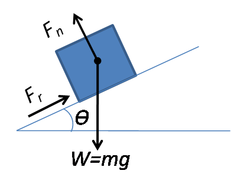

# ayudantia-04

## ejercicio-01 (30 minutos)

a) nombrar todas las fuerzas que afectan a un cuerpo de masa m, en un plano inclinado, en el planeta tierra y dibujar el diagrama del cuerpo libre.

b)

## solución ejercicio-01

a) un cuerpo en un plano inclinado presenta 3 fuerzas:

- fuerza de peso, y en dirección hacia abajo.
- fuerza normal, en dirección perpendicular al plano inclinado.
- fuerza de roce, paralela al plano inclinado, oponiéndose al deslizamiento del cuerpo.

b)

## ejercicio-02 (30 minutos)

describir

a)

b)

## solución ejercicio-02

## ejercicio-03 (30 minutos)

## solución ejercicio-03
