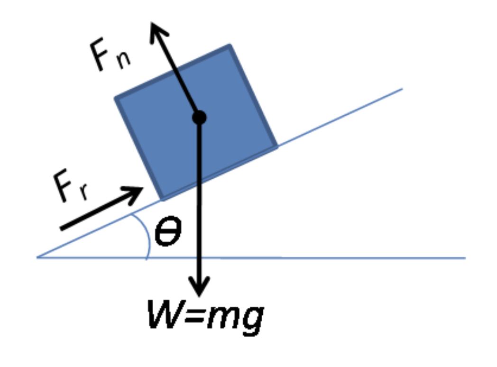

# ayudantia-04

## ejercicio-01 (30 minutos)

a) nombrar todas las fuerzas que afectan a un cuerpo de masa m, en un plano inclinado, con aceleración cero, en el planeta tierra y dibujar el diagrama del cuerpo libre.

b) nombrar cuáles son los causantes de las fuerzas sobre la masa m.

## solución ejercicio-01

a) un cuerpo en un plano inclinado presenta 3 fuerzas:

- fuerza de peso, y en dirección hacia abajo.
- fuerza normal, en dirección perpendicular al plano inclinado.
- fuerza de roce estático, paralela al plano inclinado, que se opone al deslizamiento o movimiento del cuerpo.

b)

- la fuerza de peso existe porque nuestro cuerpo de masa m está sobre el planeta tierra, y la tierra ejerce una fuerza gravitacional sobre este cuerpo.
- la fuerza normal existe porque nuestro cuerpo de masa m está en contacto con una superficie, y por la tercera ley de Newton: como el cuerpo de masa m empuja a la superficie, la respuesta del plano es empujar al cuerpo de masa m, en la misma magnitud y en sentido contrario.
- la fuerza de roce estático existe porque nuestro cuerpo de masa m está en contacto con una superficie inclinada y en reposo. esta fuerza se opone al movimiento del cuerpo.

## ejercicio-02 (30 minutos)

a)

b)

## solución ejercicio-02

a)

b)

## ejercicio-03 (30 minutos)

## solución ejercicio-03

a)

en una máquina de Atwood, tenemos que la aceleración de las masas m1 y m2 conectadas por una cuerda ideal son de igual magnitud, y dirección contraria. si asumimos que a es positiva hacia arriba, y que m1 acelera hacia arriba, y que m2 acelera hacia abajo, tenemos esta ecuación:

$$a = g \cdot \frac{m1 - m2}{m1+ m2}$$

nos damos cuenta que la aceleración es el múltiplo de 3 factores: g que es un valor positivo, la suma de las masas que también es positivo, y la resta entre m1 y m2, que definirá el signo de la aceleración así:

- si m1 > m2, entonces m1 - m2 > 0, y por lo tanto, a también es positivo, lo que tiene
