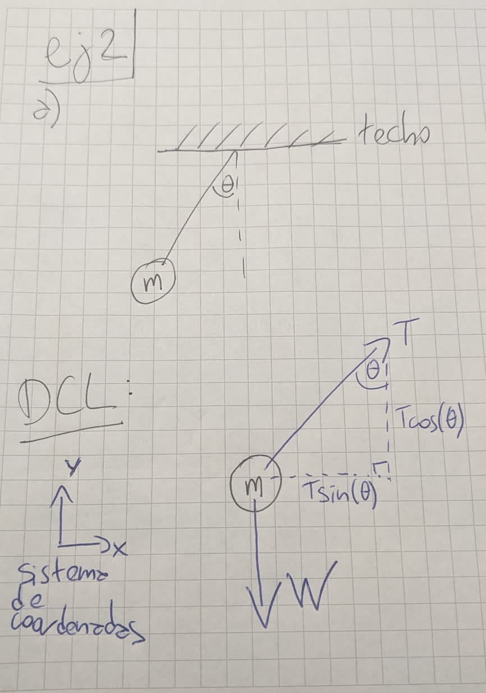

# ayudantia-04

## ejercicio-01 (30 minutos)

a) nombrar todas las fuerzas que afectan a un cuerpo de masa m, en un plano inclinado, con aceleración cero, en el planeta tierra y dibujar el diagrama del cuerpo libre.

b) nombrar cuáles son los causantes de las fuerzas sobre la masa m.

## solución ejercicio-01

a) un cuerpo en un plano inclinado presenta 3 fuerzas:

- fuerza de peso, y en dirección hacia abajo.
- fuerza normal, en dirección perpendicular al plano inclinado.
- fuerza de roce estático, paralela al plano inclinado, que se opone al deslizamiento o movimiento del cuerpo.

b)

- la fuerza de peso existe porque nuestro cuerpo de masa m está sobre el planeta tierra, y la tierra ejerce una fuerza gravitacional sobre este cuerpo.
- la fuerza normal existe porque nuestro cuerpo de masa m está en contacto con una superficie, y por la tercera ley de Newton: como el cuerpo de masa m empuja a la superficie, la respuesta del plano es empujar al cuerpo de masa m, en la misma magnitud y en sentido contrario.
- la fuerza de roce estático existe porque nuestro cuerpo de masa m está en contacto con una superficie inclinada y en reposo. esta fuerza se opone al movimiento del cuerpo.

## ejercicio-02 (30 minutos)

a) dibujar el diagrama de cuerpo libre de un cuerpo de masa m, que está sostenido por una cuerda ideal desde el techo. la cuerda no está perpendicular al techo, sino que está en un ángulo theta.

b) aplicar la segunda ley de Newton y demostrar con ecuaciones que en esa posición, el cuerpo de masa m tiene una aceleración distinta de cero. demostrar que si la cuerda estuviera perpendicular, el cuerpo no estaría acelerando en el eje X.

## solución ejercicio-02

a)

b)

como tenemos la fuerza de tensión T en una diagonal, la descomponemos según el ángulo theta, usando primero la función seno y luego coseno:

$$sin(\theta) = \frac{cateto opuesto}{hipotenusa} = \frac{T_x}{T}$$

y despejamos de esta ecuación T en eje X:

$$T_x = T \cdot sin(\theta)$$

ahora con coseno, planteamos:

$$cos(\theta) = \frac{cateto adyacente}{hipotenusa} = \frac{T_y}{T}$$

y despejamos de esta ecuación T en eje Y:

$$T_y = T \cdot cos(\theta)$$

entonces ahora sabemos que el vector de tensión T es:

$$T = T_x \cdot \hat{x} + T_y \cdot\hat{y} = T \cdot sin(\theta) \cdot \hat{x} + T \cdot cos(\theta) \cdot \hat{y}$$

y ahora sí podemos usar la segunda ley de Newton:

$$\vec{F} = m \cdot \vec{a}$$

donde descomponemos en ejes X e Y:

$$ F_x = m \cdot a_x$$

$$ F_y = m \cdot a_y$$

y luego reemplazamos para cada eje:

$$ T \cdot sin(theta) = m \cdot a_x$$

$$ T \cdot cos(theta) - W = m \cdot a_y$$

vemos que el cuerpo tiene aceleración en ambos ejes X e Y, ya que el ángulo es distinto de cero.

si la cuerda estuviera perpendicular, el ángulo sería 0, y entonces en ese caso, las ecuaciones resultarían:

$$ T \cdot 0 = m \cdot a_x$$

$$ T \cdot 1 - W = m \cdot a_y$$

y vemos que en el eje X el lado izquierdo es 0, por lo tanto la aceleración en el eje X es cero.

## ejercicio-03 (30 minutos)

con la siguiente máquina de Atwood con cuerdas ideales:

a) hacer supuestos de coordenadas y encontrar la aceleración en función de la gravedad y las masas.

b) demostrar que la aceleración no depende del largo de la cuerda ideal, ni de la altura de la máquina de Atwood.

## solución ejercicio-03

a)

con el sistema de coordenadas propuesto en la ilustración, vemos que la aceleración a es positiva hacia arriba, así que podemos escribir en 1D, respetando los signos, la segunda ley de Newton para ambas masas:

$$T - W_1 = m_1 \cdot (-a)$$

$$T - W_2 = m_2 \cdot (a)$$

este es un sistema de 2 ecuaciones (1 por cada cuerpo) y 2 incógnitas (T y a), así que lo podemos resolver!

como queremos despejar la aceleración, una estrategia es encontrar una manera de eliminar T al hacer aritmética entre estas dos ecuaciones.

una opción es entonces tomar la primera ecuación, y restarle la segunda, entonces a cada lado resulta:

(lado izquierdo ecuación 1) - (lado izquierdo ecuación 2) = (lado derecho ecuación 1) - (lado derecho ecuación 2)

y reemplazando:

$$(T - W_1) - (T - W_2) = (m_1 \cdot (-a)) - (m_2 \cdot (a))$$

acordándonos que -1 por -1 es 1, podemos simplificar:

$$W_2 - W_1 = -a \cdot (m_1 + m_2)$$

y despejando a:

$$a = \frac{-(W_2 - W_1)}{m_1 + m_2} = \frac{W_1 - W_2}{m_1 + m_2}$$

y reemplazando los pesos por el producto entre la masa y la gravedad:

$$a = \frac{m_1 \cdot g - m_2 \cdot g}{m_1 + m_2}$$

y factorizando por g:

$$a = \frac{g \cdot (m_1 \cdot - m_2)}{m_1 + m_2}$$

nos damos cuenta que la aceleración es el múltiplo de 3 factores: g que es un valor positivo, la suma de las masas que también es positivo, y la resta entre m1 y m2, que definirá el signo de la aceleración así:

- si m1 > m2, entonces m1 - m2 > 0, y por lo tanto, a también es positivo, lo que tiene sentido, ya que si la masa m1 es mayor, m1 caerá y arrastra a m2 hacia arriba a través de tensión de la cuerda ideal.

- en caso contrario, m2 > m1, entonces m1 - m2 < 0, y por lo tanto, a es negativo, y occure lo contrario, la masa m2 cae por la gravedad y arrastra a m1 hacia arriba a través de la tensión de la cuerda ideal.

- caso límite: las masas son iguales, entonces m1 - m2 = 0, y por lo tanto, la aceleración es cero, o sea que la velocidad de los cuerpos es constante y no cambia.

b)

como la ecuación de aceleración es:

$$a = \frac{g \cdot (m_1 \cdot - m_2)}{m_1 + m_2}$$

por inspección, vemos que solamente depende de la gravedad y de las masas, y no depende de factores como el largo de la cuerda ideal o de la altura con respecto a la tierra de la máquina de Atwood.

la cuerda ideal permite que los cuerpos influyan entre sí, y como no tiene masa, no influye gravitacionalmente en los cálculos. además, como su largo es constante, eso fuerza a que las aceleraciones de los cuerpos sean de igual magnitud, y dirección distinta según la polea. otro resultado de usar una cuerda ideal es que la magnitud de la tensión que ven ambos cuerpos es la misma.
