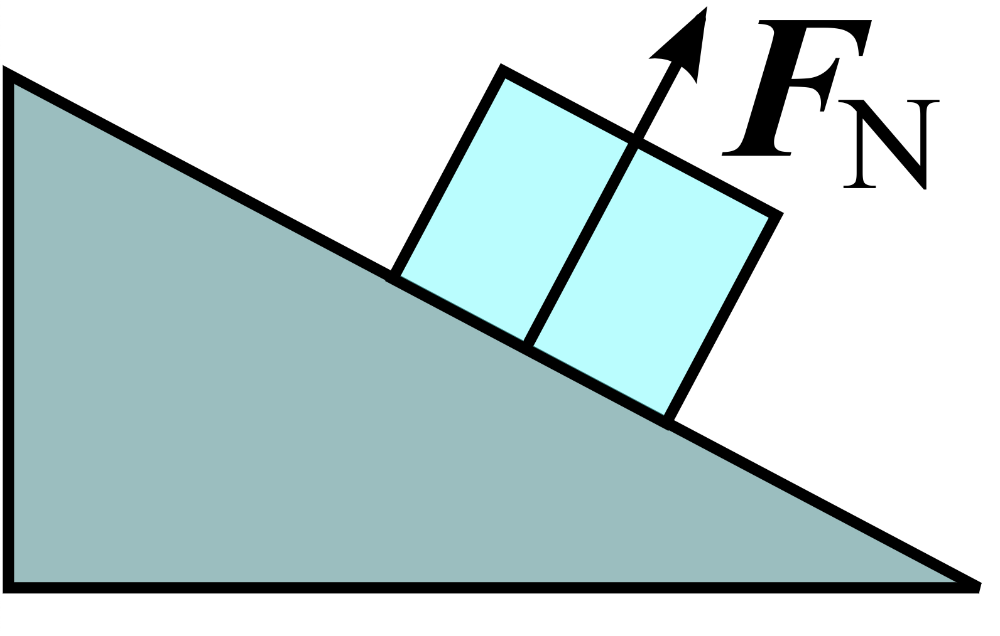

# clase-04

martes 30 agosto 2022, presencial

## repaso clase anterior y programa hoy (15 min)

la clase anterior vimos la unidad 1: cinemática en 1 y 2 dimensiones

- definición de cinemática
- ecuación de velocidad en 1D
- ecuación de velocidad en 2D
- ecuación de posición en 1D
- ecuación de posición en 2D

la clase de hoy es la unidad 2: dinámica

- definición de dinámica
- fuerza de peso
- fuerza normal
- roce estático y roce dinámico
- fuerza de tensión, cuerdas ideales y poleas
- máquina de Atwood

## definición de dinámica

acordémonos que en cinemática tratamos de encontrar expresiones matemáticas para describir la posición, velocidad y aceleración de cuerpos, sin importar la causa de sus cambios en posición, velocidad y aceleración.

en dinámica, por el contrario, tomaremos en cuenta las fuerzas y la segunda ecuación de Newton, que dice:

$$\vec{F} = m \cdot \vec{a}$$

## fuerza de peso

el peso se anota como (W, por inglés "weight").

se mide en Newton, es una fuerza.

la ecuación para un cuerpo de masa m sujeta a una gravedad g es:

$$W = m \cdot g$$

la masa es inherente al cuerpo y constante, el peso depende de la gravedad, que es distinta en otros planetas.

## fuerza normal

fuente: https://en.wikipedia.org/wiki/Normal_force#/media/File:Incline.svg

## roce estático y dinámico

## fuerza de tensión, cuerdas ideales y poleas

## máquina de Atwood

fuente de la imagen: https://en.wikipedia.org/wiki/Atwood_machine#/media/File:Atwood.svg

https://es.wikipedia.org/wiki/M%C3%A1quina_de_Atwood

con los supuestos:

- la masa de la cuerda es 0 (en comparación con los cuerpos)
- la cuerda es inextensible, su largo siempre es constante.

consideramos dos cuerpos, con masas m1 y m2.

## referencias

- https://www.khanacademy.org/science/physics/forces-newtons-laws/normal-contact-force/v/normal-force-and-contact-force
- https://www.khanacademy.org/science/physics/forces-newtons-laws#inclined-planes-friction
