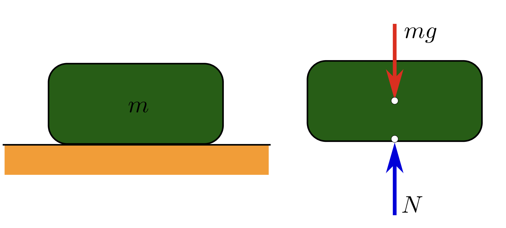
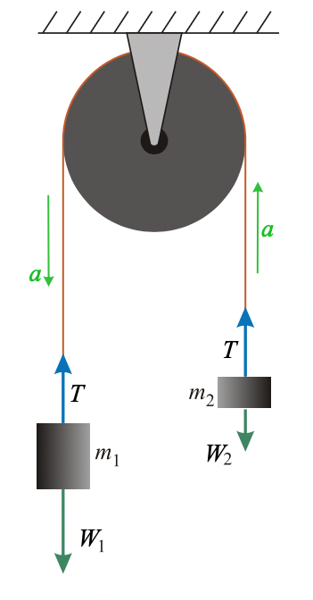

# clase-04

martes 30 agosto 2022, presencial

## repaso clase anterior y programa hoy (15 min)

la clase anterior vimos la unidad 1: cinemática en 1 y 2 dimensiones

- definición de cinemática
- ecuación de velocidad en 1D
- ecuación de velocidad en 2D
- ecuación de posición en 1D
- ecuación de posición en 2D

la clase de hoy es la unidad 2: dinámica

- definición de dinámica
- fuerza de peso
- fuerzas de contacto: fuerza normal y fuerzas de roce
- fuerza de tensión, cuerdas ideales y poleas
- máquina de Atwood

## definición de dinámica

acordémonos que en cinemática tratamos de encontrar expresiones matemáticas para describir la posición, velocidad y aceleración de cuerpos, sin importar la causa de sus cambios en posición, velocidad y aceleración.

en dinámica, por el contrario, tomaremos en cuenta las fuerzas y la segunda ecuación de Newton, que dice:

$$\vec{F} = m \cdot \vec{a}$$

## fuerza de peso

fuente: https://en.wikipedia.org/wiki/Weight#/media/File:WeightNormal.svg

la fuerza de peso se anota como W, por inglés "weight".

se mide en Newton, es una fuerza.

la ecuación para un cuerpo de masa m sujeta a una gravedad g es:

$$W = m \cdot g$$

la masa es inherente al cuerpo y constante, el peso depende de la gravedad, que es distinta en otros planetas.

la dirección de la fuerza de peso es hacia el centro del planeta, y por la curvatura del planeta tierra, podemos asumir que siempre es perpendicular al suelo y hacia abajo.

## fuerzas de contacto: fuerza normal y fuerzas de roce

fuente: https://en.wikipedia.org/wiki/Normal_force#/media/File:Incline.svg

la fuerza normal se anota como N, por normal.

se mide en Newton, es una fuerza.

la fuerza normal es una fuerza perpendicular a la superficie de contacto.

normal hace referencia al sentido geométrico de perpendicular, no de ordinario.

si somos un cuerpo y estamos en un plano, la fuerza normal y la fuerza de gravedad sobre nosotros se contrarrestan y la sumatoria de fuerzas en nosotros es cero, por lo tanto, no tenemos aceleración.

pero si estamos en un plano inclinado, la fuerza de gravedad sigue apuntando hacia el centro de la tierra, hacia abajo, y la fuerza normal es perpendicular al plano inclinado, en un ángulo, y la ecuación queda:

$$N = m \cdot g \cdot cos(\theta)$$

si esas fueran las dos únicas fuerzas sobre un cuerpo en un plano inclinado, la sumatoria sería siempre distinta de cero para cualquier ángullo distinto de cero, y por lo tanto siempre tendría aceleración.

pero por nuestra experiencia vital sabemos que podemos estar parados, sin acelerar, sobre planos inclinados! eso es porque hay otra fuerza en juego, que es la fuerza de roce.

la fuerza de roce es una fuerza, se mide en Netwon.

la fuerza de roce tiene dos sabores: estático y dinámico.

fuente:https://en.wikipedia.org/wiki/Normal_force#/media/File:Friction_relative_to_normal_force_(diagram).png

si descomponemos la fuerza normal, tiene una componente que se opone a la fuerza de gravedad, y otra que trata de hacer que el cuerpo se deslice por la superficie.

la fuerza de roce estático es la que se opone a que el cuerpo se deslice, y que les permite a los cuerpos poder estar sobre un plano inclinado sin acelerar.

esta fuerza de roce tiene un máximo valor, que va a ser dependiente del material y del ángulo de inclinación, que después de ser superados, el cuerpo se desliza y ya no tiene fuerza de roce estático.

cuando el cuerpo ya se está moviendo, deja de ser estático, ahora tiene una force de roce dinámico, que depende del material.

en general, el coeficiente de roce estático es mayor que dinámico, por lo que se necesita aplicar una fuerza para vencer el roce estático, y tras ser vencido, se necesita menos fuerza para mantenerlo en movimiento.

## fuerza de tensión, cuerdas ideales y poleas

## máquina de Atwood

fuente de la imagen: https://en.wikipedia.org/wiki/Atwood_machine#/media/File:Atwood.svg

https://es.wikipedia.org/wiki/M%C3%A1quina_de_Atwood

con los supuestos:

- la masa de la cuerda es 0 (en comparación con los cuerpos)
- la cuerda es inextensible, su largo siempre es constante.

consideramos dos cuerpos, con masas m1 y m2.

## referencias

- https://www.khanacademy.org/science/physics/forces-newtons-laws/normal-contact-force/v/normal-force-and-contact-force
- https://www.khanacademy.org/science/physics/forces-newtons-laws#inclined-planes-friction
